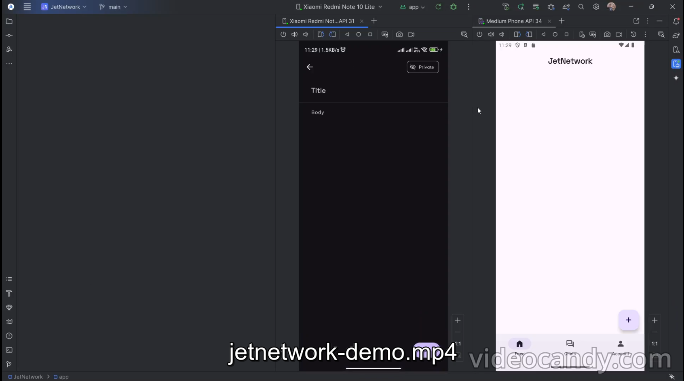

# JETNETWORK

[](./screenshots/jetnetwork-demo.mp4)

> **SHORT DESCRIPTION**
>
> **🚧 This app is currently under development 🚧**
> 
> This is social media application made using Kotlin and Firebase
> App is made using Jetpack Compose and Kotlin
> For database features, Firebase is used.

## SCREENSHOTS

To be added..

## FILE STRUCTURE
```
 📂src/
 ├── 📂androidTest/
 ├── 📂main/
 │   ├── 📂java/{app_name}/
 │   │   ├── 📂data/
 │   │   ├── 📂di/
 │   │   ├── 📂domain/
 │   │   ├── 📂presentation/
 │   │   ├── 📂ui/
 │   │   ├── 📂utils/
 │   │   ├── 📃MainActivity.kt
 │   │   ├── 📃JNViewModel.kt
 │   │   └── 📃JNApplication.kt
 │   └── 📂res/
 └── 📂test/
     └── 📂java/{app_name}/
```
#### Info about the folders
1. `data` - contains the implementation of the firebase repository functions
2. `di` - contains the dependency injection files
3. `domain` - contains the interfaces, and models
4. `presentation` - contains the viewmodels and composables
5. `ui` - contains Theme, Typography and Colors files, and Main UI State
6. `utils` - contains utility functions likes, name formatters, date formatters, etc.

## ARCHITECTURE FOLLOWED

To be added ...

## FEATURES/SCREENS

### Login and Registration Flow

1. For `login` & `registration`- **Google FirebaseAuth** is used, Other than that, **Anonymous user** and **email & password login** is also supported.
2. The latest `Android Credential Manager` API is being is used in this application, for seamless login and registration. See [API here](https://developer.android.com/identity/sign-in/credential-manager)
3. On the app startup, `Anonymous User` is created in the background, so that if someone does not want to login with credentials, can skip the login process.

### Feed Page Operations

1. Currently in the feed page, displays all the posts, which are set to `public` visibility.
2. Users can `comment`, `like` the post.
3. Each `Feed Item` has comment button, which opens up a `Modal Bottom Sheet`, that renders the comments related to that post.

### Post CRUD Operations

1. Currently `Anonymous Users` cannot create posts with public visibility. This is done to mimic how a real world can give certain features of the app for testing purposes.

### Messaging Operations

1. When user opens the `ConversationList` Screen then, a `chat user` is created for easing fetching and search, as Firebase Auth does not allow querying on other users.
2. `ConversationList` has a `Search bar` which helps in finding users. The query used in searching users is
    ```kotlin
    override suspend fun getUsers(searchQuery: String): List<User> {
            val searchQueryLC = searchQuery.lowercase()
            return Firebase.firestore
                .collection(USERS_COLLECTION)
                .whereGreaterThanOrEqualTo(DISPLAY_NAME_FIELD, searchQueryLC)
                .whereLessThanOrEqualTo(DISPLAY_NAME_FIELD, searchQueryLC + '\u8FFF')
                .get()
                .await()
                .toObjects<User>()
                .filter { user ->
                    user.id != authRepository.currentUserId
                }
        }

    ```
    This is used, as firebase does not have query operations, and recommends using Third Party APIs like ElasticSearch, TypeSense, etc. This is a simpler version.
3. A `compositeId` is stored in the database, for easing searching, also
    ```kt
    override suspend fun conversationExists(targetUser: User): Boolean {
        val currentUserId = authRepository.currentUserId
        val pair1 = "${currentUserId}_${targetUser.id}"
        val pair2 = "${targetUser.id}_${currentUserId}"

        return !Firebase.firestore
            .collection(CONVERSATION_COLLECTION)
            .whereIn(COMPOSITE_FIELD, listOf(pair1, pair2))
            .get()
            .await()
            .isEmpty

    }
    ```

